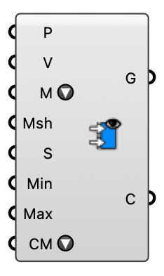

#  Wind Field Viewer - [[source code]](https://github.com/Eddy3D-Dev/Eddy3D/search?q=%22Wind%20Field%20Viewer%22)

Visualize a probed wind field: colored velocity arrows, a point cloud, or a heatmap mesh. Feed the Probe component's points + velocity (or any points + vectors).

#### Input
* ##### Points (P) 
Sample points (e.g. the probe points).
* ##### Velocity (V) 
Velocity vector per point.
* ##### Display Mode (M) 
How to render the field: Vector Field (arrows), Point Cloud, Heatmap Mesh (colors a supplied mesh), Streamlines, or Volumetric Smoke.
* ##### Msh 
Surface to color for Heatmap Mesh mode (colored per vertex from the nearest sample). Ignored in the other modes.
* ##### Scale (S) 
Arrow length scale (Vector Field mode).
* ##### Min 
Lower end of the color range / filter (m/s). Empty = data minimum.
* ##### Max 
Upper end of the color range / filter (m/s). Empty = data maximum.
* ##### Color Map (CM) 
Color ramp for the speed coloring.

#### Output
* ##### Geometry (G)
Colored viz geometry for baking: arrow lines, points, or the colored mesh.
* ##### Colors (C)
Color per element (aligned with Geometry).