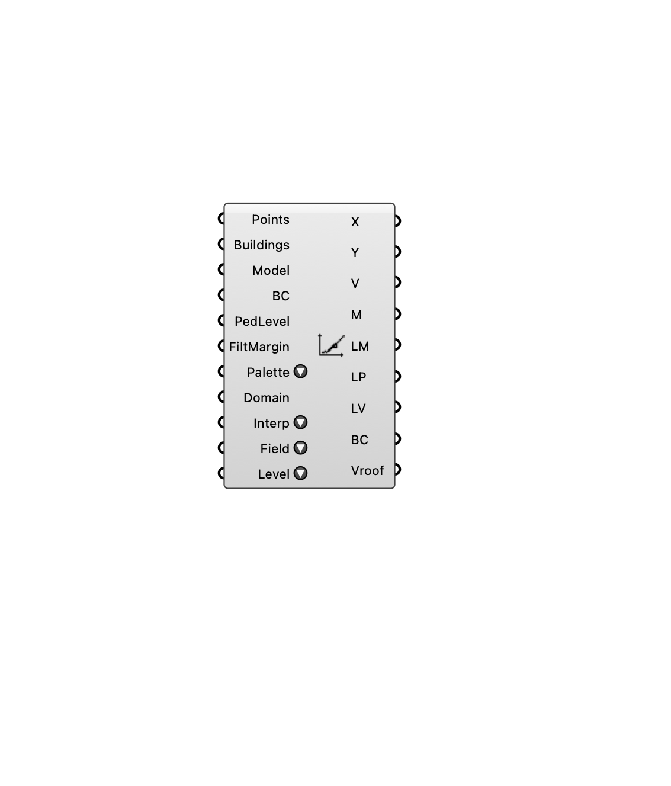

#  Wind Predictor - [[source code]](https://github.com/Eddy3D-Dev/Eddy3D/search?q=%22Wind%20Predictor%22)

Run ONNX wind-field prediction end-to-end. Computes SDF, building height, Zrelative, U/Uref, direction features from geometry, assembles the 8-channel input tensor, runs ONNX inference, and outputs predicted wind speeds. Supports legacy 1ch (U), 2ch (U + k) and new 4ch (U + k + Uroof + kroof) models.

#### Input
* ##### Points 
List of 3D points. Each point's Z must be absolute elevation (m).
* ##### Buildings 
List of Brep or Mesh objects representing buildings.
* ##### Model 
Full file path to the ONNX model. Connect the FilePath output from the ML Model component.
* ##### Boundary Conditions (BC) 
Boundary conditions from the ABL or Uniform Flow component. Uref, zRef, z0, wind directions, and EPW path are extracted automatically.
* ##### PedLevel 
Pedestrian mount height (m). Default = 1.8
* ##### FiltMargin 
Margin (in meters) to mask out from the outer perimeter of the prediction plane due to unstable boundary effects. Default = 100.0
* ##### Palette 
Color palette for visualization.
* ##### Domain 
Optional custom domain [min, max] to lock the color bounds. If empty, the colors scale dynamically to the data.
* ##### Interp 
Visualization style. Flat (pixelated) vs Smooth (interpolated colors).
* ##### Field 
Field to visualize. Affects M, LM, LP, LV outputs.
* ##### Level 
Visualization level. Roof Level only applies when a 4-channel model is loaded.

#### Output
* ##### X
X coordinate (m) of each valid input point.
* ##### Y
Y coordinate (m) of each valid input point.
* ##### Values (V)
Predicted field values at each valid input point. Outputs wind speed (m/s) or turbulent kinetic energy (m²/s²) depending on the Field input. Branches represent different wind directions.
* ##### Grid Mesh (M)
A fast-rendering contiguous coloured preview mesh of the predictions.
* ##### Legend Mesh (LM)
A colored mesh strip acting as a visual legend.
* ##### Legend Points (LP)
Locations for the legend text in the 3D viewport (Generic type to prevent red cross preview).
* ##### Legend Values (LV)
Text values corresponding to the generated legend.
* ##### Boundary Conditions (BC)
Automated simulation boundary conditions metadata.
* ##### Vroof
Predicted roof-level field values at each valid input point. Outputs wind speed or TKE depending on the Field input. Branches represent different wind directions. Empty unless a 4-channel model is used.