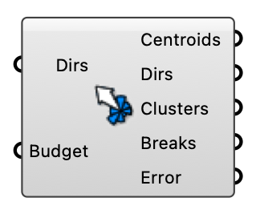

##  Wind Rose Cluster

Cluster annual wind directions into representative directions using k-means.

#### Input
* ##### Dirs 
Wind directions in degrees (e.g. hourly values from an EPW).
* ##### Budget 
Maximum number of representative directions (clusters).

#### Output
* ##### Centroids
Representative centroid direction of each cluster.
* ##### Dirs
Distinct representative wind directions in degrees, sorted ascending; plug into the ABL or Uniform Flow component's Wind Directions input.
* ##### Clusters
Clustered direction vectors as points, one branch per cluster.
* ##### Breaks
Jenks-Fisher natural breaks of the input directions.
* ##### Error
Total clustering distance (error).