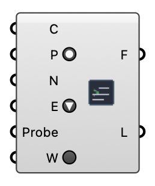

#  Write Run Scripts - [[source code]](https://github.com/Eddy3D-Dev/Eddy3D/search?q=%22Write%20Run%20Scripts%22)

Writes meshing and simulation scripts (.bat / .sh) into a Scripts/ folder under the wind study, so the workflow can be launched manually outside Grasshopper. The scripts match what the Run component executes. Write the study to disk first (Wind Case 'Write').

#### Input
* ##### Case (C) 
The wind study to generate run scripts for (Wind Case output).
* ##### Parallel (P) 
Generate scripts that decompose and run in parallel (MPI).
* ##### CPUs (N) 
Number of subdomains (MPI ranks) for parallel meshing and simulation. Leave unset (or <= 1) for automatic: the case's decomposeParDict count if > 1, else half the host cores.
* ##### Engine (E) 
OpenFOAM engine the scripts target. BlueCFD/WSL produce .bat; Docker produces .sh.
* ##### Probe 
Function-object / probes name the generated 05_PostProcess scripts sample. Match the Probe component's Name input. Default 'probes'.
* ##### Write (W) 
Set to true to (re)write the scripts into the study's Scripts/ folder.

#### Output
* ##### Scripts Folder (F)
Path to the Scripts/ folder containing the generated batch/shell files.
* ##### Logs (L)
Names of the scripts that were written.