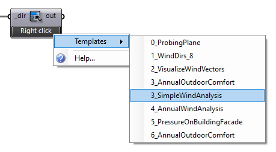
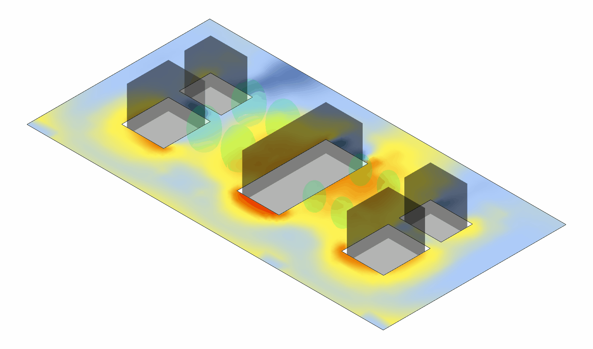
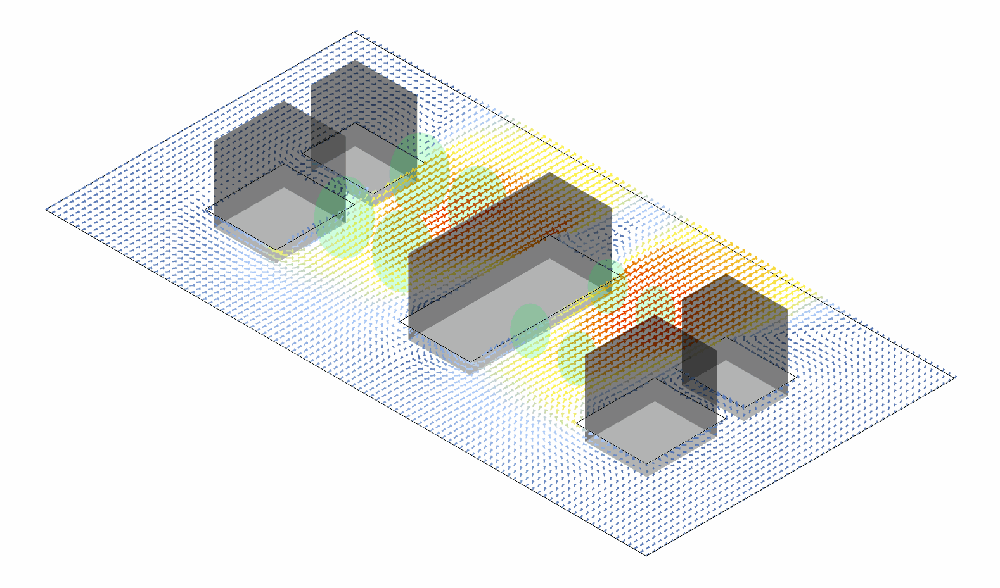
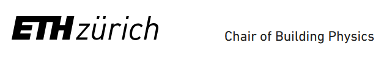

# Eddy3D

Eddy3D is a Grasshopper plugin for Rhino 8 for urban microclimate and airflow simulation. Everything now ships in a single **Eddy3D** package that bundles several modules:

- __Eddy3D Outdoor__

    ---

    Decoupled microclimate simulations, via wind and mean radiant temperature simulations. Driven by OpenFOAM and Radiance.

    ---

    [:octicons-arrow-right-24: Outdoor](#outdoor-wind-mrt)

- __Eddy3D Outdoor+__

    ---

    Fully coupled microclimate simulations, including wind, radiation, heat, and moisture transfer, driven by `urbanMicroclimateFoam` by ETH Zurich Building Physics.

    ---

    [:octicons-arrow-right-24: Outdoor+](#outdoor-coupled-microclimate)

- __Eddy3D Indoor__

    ---

    Modeling airflow, moisture content, and passive scalars in indoor spaces.

    ---

    [:octicons-arrow-right-24: Indoor](#indoor-airflow)

## Installation

### Plugin
Install **Eddy3D** via the Rhino Package Manager (`yak`) on either platform &mdash; run `PackageManager` in Rhino and search for **`Eddy3D`**.

- **Windows:** also available as a [standalone installer](https://github.com/Eddy3D-Dev/Eddy3D/releases/latest){ target="_blank" rel="noopener noreferrer" aria-label="Install Eddy3D for Windows (opens in a new tab)" }.
- **Mac:** install via the Package Manager as above.

### Simulation Engines (Windows / Mac)
Choose a simulation engine (one of the following):

- **Docker:** [Download Docker Desktop](https://www.docker.com/products/docker-desktop/){ target="_blank" rel="noopener noreferrer" aria-label="Download Docker Desktop (opens in a new tab)" } (**Recommended cross-platform**, pulls a pre-configured OpenFOAM 12 image automatically)
- **BlueCFD-Core 2024 (Windows Only):** [Download blueCFD-Core](https://bluecfd.github.io/Core/Downloads/){ target="_blank" rel="noopener noreferrer" aria-label="Download blueCFD-Core (opens in a new tab)" }
- **WSL (Windows Only):** [WSL Installation guide for Windows](https://learn.microsoft.com/en-us/windows/wsl/install){ target="_blank" rel="noopener noreferrer" aria-label="WSL Installation guide for Windows (opens in a new tab)" } (Requires `urbanMicroclimateFoam` to be installed manually)

The **MRT** component uses [Radiance](https://github.com/LBNL-ETA/Radiance){ target="_blank" rel="noopener noreferrer" aria-label="Radiance on GitHub (opens in a new tab)" }. The **Install Engines** component downloads and installs it automatically (Windows &amp; Mac, release `rad6R0P2`) under the per-user Eddy3D folder &mdash; no manual install needed.

## Requirements

| Module   | Overview                                                     | Core engine            | Package | Rhino (ver) | OS support  | OpenFOAM (ver) | Radiance (ver) |
|----------|--------------------------------------------------------------|------------------------|-----------------------|-------------|----------------|----------------|----------------|
| Outdoor  | Decoupled wind + mean radiant temp                           | OpenFOAM; Radiance     | **Eddy3D**            | 8.27        | Windows / Mac     | 12 (Foundation) |  Auto (rad6R0P2)  |
| Outdoor+ | Fully coupled (wind, radiation, heat, moisture) | OpenFOAM   | **Eddy3D** | 8.27                  | Windows / Mac | 12 (Foundation) | —              |
| Indoor   | Airflow, moisture, passive scalars (indoor)                  | OpenFOAM               | **Eddy3D**            | 8.27        | Windows / Mac     | 12 (Foundation) | -              |

## Downloads

Install **Eddy3D** from the Rhino Package Manager (run `PackageManager` in Rhino 8 and search for **`Eddy3D`**). For the current version and release notes, see the [**Eddy3D download page**](https://eddy3d.com/download/){ target="_blank" rel="noopener noreferrer" aria-label="Eddy3D download page (opens in a new tab)" }.

!!! tip "Previous Versions"
    View the [**required Rhino 8.27 build details (8.27.26019.16022, en-us)**](https://rhinoversions.github.io/?version=8.27.26019.16022&locale=en-us){ target="_blank" rel="noopener noreferrer" aria-label="required Rhino 8.27 build details (8.27.26019.16022, en-us) (opens in a new tab)" }.

!!! note "One package"
    All modules &mdash; Outdoor, Outdoor+, Indoor, MRT, and FluidX3D &mdash; now ship in the single **`Eddy3D`** package on the Rhino Package Manager (`yak`). The former separate **`UMCF`** package (Outdoor+) has been retired.

## Getting Started

!!! tip "Start from a template"
    Eddy3D ships with starter templates for every module. Right-click the **`Template`** component in Grasshopper to browse and load one, then follow the numbered markers through the canvas.

{ loading=lazy }

## Modules

<strong>Outdoor &mdash; Wind &amp; MRT</strong>

Decoupled microclimate simulations via wind (OpenFOAM) and mean radiant temperature (Radiance).

### Parallel computation

There is currently an issue with Microsoft’s and BlueCFD’s MPI dll which is why a run with multiple CPUs might fail. You need both dlls to be the same file, see the [CFD Online instructions for matching MPI DLL files](https://www.cfd-online.com/Forums/openfoam-installation/200437-bluecfd-core-2016-user-compiled-solvers-not-running-parallel.html#post687582){ target="_blank" rel="noopener noreferrer" aria-label="CFD Online instructions for matching MPI DLL files (opens in a new tab)" } to ensure that both DLLs are the same file.

### Simple workflows

We value efficient workflows! See below for a one-directional urban CFD setup.

{ loading=lazy }

*Video walkthroughs are on the [Video Tutorials](tutorials.md) page.*

<strong>Outdoor+ &mdash; Coupled microclimate</strong>

{ loading=lazy }

**Outdoor+** is the fully coupled microclimate module of the **Eddy3D** plugin, built on the open-source **`urbanMicroclimateFoam`** (UMCF) solver for `OpenFOAM`.

### Key Features

 🌊 **CFD** - Solves turbulent, convective airflow

- Handles heat and moisture transport in the `air` subdomain

 🏗️ **HAM** - Manages absorption and transport

- Controls storage of heat and moisture in porous building materials

☀️ **RAD** - Calculates net longwave and shortwave radiative heat fluxes

- Uses view factor approach

🌳 **VEG** - Solves heat balance for urban trees

- Handles green surfaces

{ loading=lazy }

{ loading=lazy }

<strong>Indoor &mdash; Airflow</strong>

Modeling airflow, moisture content, and passive scalars in indoor spaces.

*See the [Video Tutorials](tutorials.md) page for the Indoor Wind &amp; COVID-19 walkthrough.*

## Acknowledgments

The plugin is based on the `urbanMicroclimateFoam` (UMF) open-source solver based on OpenFOAM, developed by the [Chair of Building Physics at ETH Zürich](https://carmeliet.ethz.ch/){ target="_blank" rel="noopener noreferrer" aria-label="Chair of Building Physics at ETH Zürich (opens in a new tab)" } the [Canada Research Chair Tier I in Multiscale Building Physics](https://www.usherbrooke.ca/recherche/en/udes/clusters/chairs/canada/multiscale-building-physics) at Université de Sherbrooke, Canada.

- [urbanMicroclimateFoam GitHub repository](https://github.com/OpenFOAM-BuildingPhysics/urbanMicroclimateFoam){ target="_blank" rel="noopener noreferrer" aria-label="urbanMicroclimateFoam GitHub repository (opens in a new tab)" }

{ loading=lazy }

This project is partially funded by [Perkins&Will Research](https://perkinswill.com/research/){ target="_blank" rel="noopener noreferrer" aria-label="Perkins&Will Research (opens in a new tab)" }. Their support has been instrumental in advancing this tool.

{ loading=lazy }

___

This project originated from the VIP - Surrogate Models for Urban Regeneration during Fall 2024. Visit the [VIP - Surrogate Models for Urban Regeneration documentation](https://vip-smur.github.io/24fa-microclimate-umcf/){ target="_blank" rel="noopener noreferrer" aria-label="VIP - Surrogate Models for Urban Regeneration documentation (opens in a new tab)" } for more details and view the final presentation.
