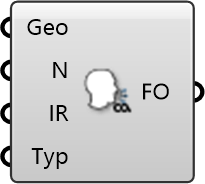

##  CO2 Emitter

CO2 Source
 
 Simulates carbon dioxide generation, typically from occupants. Use this to assess ventilation effectiveness and air quality.
 
 
 Eddy3D 0.5.0.815

#### Input
* ##### Geo 
Geometry
* ##### N 
Name
* ##### IR 
Injection Rate imposed on object
* ##### Typ 
Type: Absolute [-] or specific [1/m³]

#### Output
* ##### FO
Function Object