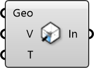

##  Indoor Inlet

Ventilation Inlet
 
 Defines where air enters the room, such as diffusers, windows, or doors.
 
 
 Eddy3D 0.5.0.815

#### Input
* ##### Geo 
Geometry
* ##### V 
Velocity [m/s]
* ##### T 
Temperature [C]

#### Output
* ##### In
Inlet