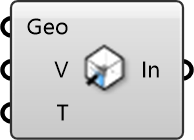

##  Indoor Inlet

Ventilation Inlet

 Defines where air enters the room, such as diffusers, windows, or doors.

 Eddy3D 1.0.0.827

#### Input
* ##### Geo 
Geometry
* ##### V 
Velocity [m/s]
* ##### T 
Temperature [C]

#### Output
* ##### In
Inlet