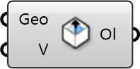

##  Indoor Outlet

Ventilation Outlet
 
 Defines where air exhausts from the room, such as return grilles or open windows.
 
 
 Eddy3D 0.5.0.815

#### Input
* ##### Geo 
Geometry
* ##### V 
Velocity [m/s]. The default is a zero length vector indicating that there is no force removing air from the space

#### Output
* ##### Ol
Outlet