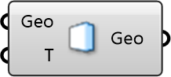

##  Indoor Wall

Indoor Wall/Boundary

 Defines a solid boundary for indoor simulations, such as walls, floors, or ceilings. Allows specification of surface temperature for thermal analysis.

 Eddy3D 1.0.0.827

#### Input
* ##### Geo 
Geometry
* ##### T 
Temperature [C]

#### Output
* ##### Geo
Geometry