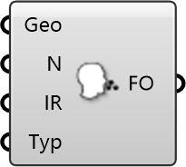

##  Viral Emitter

Pathogen Source
 
 Simulates the release of airborne pathogens (e.g., viruses) from a specific location to analyze infection risk and dispersion patterns.
 
 
 Eddy3D 0.5.0.815

#### Input
* ##### Geo 
Geometry
* ##### N 
Name
* ##### IR 
Injection Rate imposed on object
* ##### Typ 
Type: Absolute [-] or specific [1/m³]

#### Output
* ##### FO
Function Object