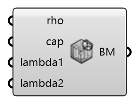

##  Brick Material - [[source code]](https://github.com/Eddy3D-Dev/Eddy3D-UMCF/blob/release/UMCF/CMP/Solid/Hamstad5BrickCMP.cs)

Parameters of building material model "Hamstad5Brick"

#### Input
* ##### rho
rho
* ##### cap
cap
* ##### lambda1
lambda1
* ##### lambda2
lambda2

#### Output
* ##### BM
Brick material parameters