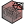
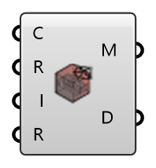

##  Create Mesh - [[source code]](https://github.com/Eddy3D-Dev/Eddy3D-UMCF/blob/release/UMCF/CMP/Visualization/CreateMeshCMP.cs)

Creates a mesh from point and face data in .txt files

#### Input
* ##### C
UMCF Case class to extract the working directory
* ##### R
UMCF Case region to visualize
* ##### I
List of face indices to visualize (optional)
* ##### R
Set to True to run the mesh generation

#### Output
* ##### M
Generated unified mesh
* ##### D
Geometric and topological mesh data