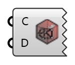

##  Read checkMesh - [[source code]](https://github.com/Eddy3D-Dev/Eddy3D-UMCF/blob/release/UMCF/CMP/Visualization/ReadcheckMeshCMP.cs)

Read and visualize sets resulting from checkMesh function

#### Input
* ##### C
UMCF Case class to extract the working directory
* ##### D
UMCF Mesh class to filter mesh faces and cells

#### Output