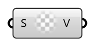

##  calculated - [[source code]](https://github.com/Eddy3D-Dev/Eddy3D-UMCF/blob/release/UMCF/CMP/Meta/calculatedCMP.cs)

calculated value

#### Input
* ##### S
Scalar component of uniform value.

#### Output
* ##### V
The created calculated value instance.