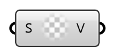

##  uniform - [[source code]](https://github.com/Eddy3D-Dev/Eddy3D-UMCF/blob/release/UMCF/CMP/Meta/uniformCMP.cs)

uniform value

#### Input
* ##### S
Scalar component of uniform value

#### Output
* ##### V
The created uniform value instance