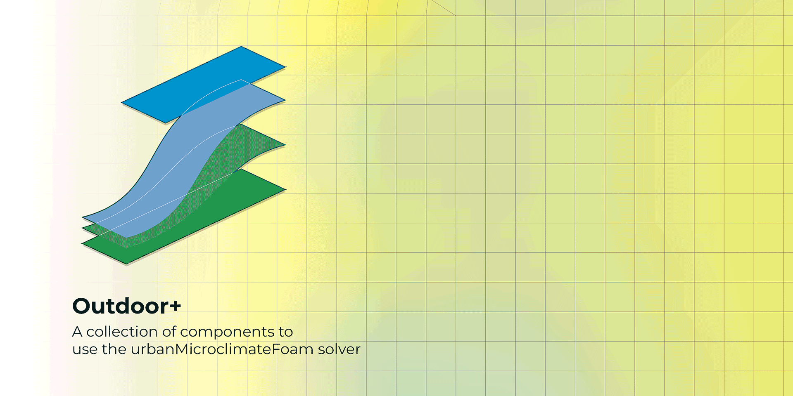
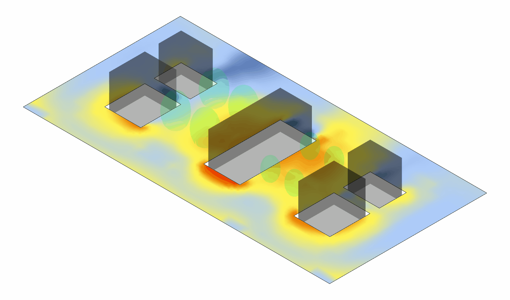
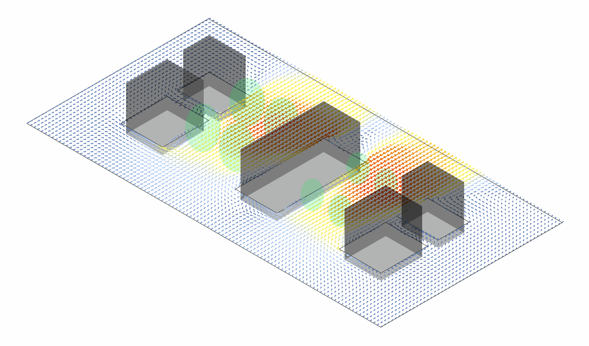

# Eddy3D &mdash; Outdoor+

### A Grasshopper plugin for microclimate simulations
___
The plugin is based on the `urbanMicroclimateFoam` open-source solver based on OpenFOAM, developed by the [Chair of Building Physics at ETH Zürich](https://carmeliet.ethz.ch/). 

- Github repository: [https://github.com/OpenFOAM-BuildingPhysics/urbanMicroclimateFoam](https://github.com/OpenFOAM-BuildingPhysics/urbanMicroclimateFoam)
- Gitlab repository: [https://gitlab.ethz.ch/openfoam-cbp/solvers/urbanmicroclimatefoam](https://gitlab.ethz.ch/openfoam-cbp/solvers/urbanmicroclimatefoam)

___
## Overview
**UMCF** (`urbanMicroclimateFoam`) is an open-source solver for coupled physical processes modeling urban microclimate based on `OpenFOAM`.

### Key Features
 **CFD** - Solves turbulent, convective airflow
- Handles heat and moisture transport in the `air` subdomain

 **HAM** - Manages absorption and transport
- Controls storage of heat and moisture in porous building materials

 **RAD** - Calculates net longwave and shortwave radiative heat fluxes
- Uses view factor approach

 **VEG** - Solves heat balance for urban trees
- Handles green surfaces

___

This project originated from the VIP - Surrogate Models for Urban Regeneration during Fall 2024. You can visit the GitHub repository for more details and view the final presentation:
- 

___

### Team

| Name | Seniority | Major | Department | GitHub |
|------|-----------|-------|------------|---------|
| Marcelo Alvarez | Masters | Architecture (DC) | ARCH | [@alvarezdmarch](https://github.com/alvarezdmarch) |
| Gonzalo Vegas | PhD | Architecture | ARCH | [@gvegaso](https://github.com/gvegasol) |
| Shruti Jadhav | Masters | Architecture (HBP) | ARCH | [@ShrutiJadhav27](https://github.com/ShrutiJadhav27) |
| Rui Shen | Masters | Architecture (DC) | ARCH | [@ShiRo-25](https://github.com/ShiRo-25) |
| Chinmay Rothe | Masters | Architecture (HBP) | ARCH | [@ChinmayR5](https://github.com/ChinmayR5) |
| Sina Rahimi | PhD | Building Science | ENG/ARCH | [@sinarhm](https://github.com/sinarhm) |