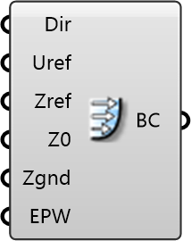

##  ABL Flow

Atmospheric Boundary Layer (ABL) Inlet
 
 Sets up a logarithmic wind profile based on aerodynamic roughness length (z0). Essential for accurate urban wind flow simulation, representing the friction of the upwind terrain.
 
 
 Eddy3D 0.5.0.815

#### Input
* ##### Dir 
Wind directions to simulate. Units: degrees (0-359). 0° = North, 90° = East. Use multiple for annual studies.
* ##### Uref 
Wind speed at reference height. Units: m/s. Typical urban: 3-8 m/s. Default: 5 m/s
* ##### Zref 
Height where velocity is measured (weather station height). Units: m. Standard: 10m. Default: 10m
* ##### Z0 
Aerodynamic roughness length. Units: m. Examples: 0.01 (open terrain), 0.3 (suburban), 1.0 (urban). Default: 1m
* ##### Zgnd 
Minimum z-coordinate of terrain. Units: m. Usually 0 for flat terrain. Default: 0m
* ##### EPW 
Optional: Path to EnergyPlus weather file (.epw) for climate-based wind data.

#### Output
* ##### BC
Wind inlet boundary condition for Domain component