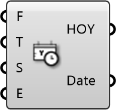

##  Analysis Period

Analysis Period
 
 Defines a specific time period for analysis (e.g., Summer from 9am-5pm). Outputs a list of hours (HOY) to filter simulation results for seasonal or daily studies.
 
 
 Eddy3D 0.5.0.815

#### Input
* ##### F 
From Day [1-365]
* ##### T 
To Day [1-365]
* ##### S 
Start Hour [1-24]
* ##### E 
End Hour [1-24]

#### Output
* ##### HOY
Hours in the year
* ##### Date
DateTime objects