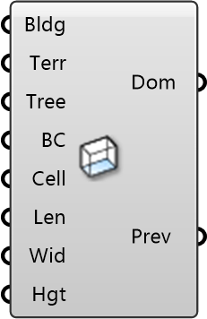

##  Box Domain

Rectangular Simulation Domain
 
 Defines a box-shaped computational domain for the wind simulation. Best suited for single-direction wind analysis or wind tunnel comparisons.
 
 
 Eddy3D 0.5.0.815

#### Input
* ##### Bldg 
Building geometry (Breps or Meshes). These create wall boundary conditions in the CFD mesh.
* ##### Terr 
Optional: Ground surface geometry. Must extend beyond domain bounds. If omitted, a flat ground is assumed.
* ##### Tree 
Optional: Tree/vegetation objects from Tree component. Creates porous zones for wind resistance.
* ##### BC 
Wind inlet conditions from ABL Flow or Uniform Flow component. Defines wind speed, direction, and turbulence.
* ##### Cell 
Base mesh cell size. Units: meters. Smaller = more accurate but slower. Typical: 5-20m. Default: 20m
* ##### Len 
Domain length (wind direction). Units: meters. Recommend: 15-20x building height.
* ##### Wid 
Domain width (cross-wind). Units: meters. Recommend: 10x building width.
* ##### Hgt 
Domain height. Units: meters. Recommend: 5-6x tallest building height.

#### Output
* ##### Dom
CFD domain object for Wind Simulation component
* ##### Prev
Domain boundary mesh for visualization