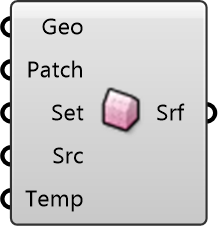

##  Building Surface

Building Material
 
 Assigns thermal and optical properties to building geometries. Affects how buildings reflect sunlight and emit heat.
 
 
 Eddy3D 0.5.0.815

#### Input
* ##### Geo 
Building facade geometry (Breps). Will be meshed into analysis patches.
* ##### Patch 
Size of analysis mesh patches. Units: meters. Smaller = more accurate but slower. Default: 3m
* ##### Set 
Optional: Material and property settings from Surface Settings component.
* ##### Src 
Surface temperature data source for MRT calculation.
* ##### Temp 
Optional: User-defined surface temperatures. Units: °C

#### Output
* ##### Srf
Radiation surface for MRT Simulation component