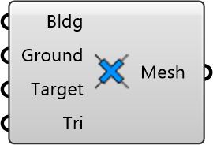

##  Cull Ground Mesh

Remove ground mesh faces that intersect buildings.
 
 Creates analysis ground mesh with building footprints cut out.
 Can be slow for large meshes - consider using QuadRemesh first.
 
 
 Eddy3D 0.5.0.815

#### Input
* ##### Bldg 
Joined building mesh for intersection.
* ##### Ground 
Ground mesh to cull. Consider QuadRemesh for control.
* ##### Target 
Target number of faces in output mesh. Default: 50000
* ##### Tri 
Convert quads to triangles in output. Default: True

#### Output
* ##### Mesh
Ground mesh with building footprints removed