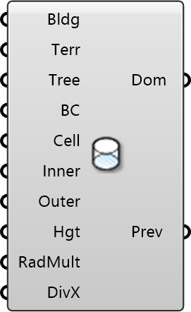

##  Cylindrical Domain

Cylindrical Simulation Domain
 
 Defines a cylindrical computational domain. Recommended for multi-directional wind analysis as it allows for changing wind directions without re-meshing.
 
 
 Eddy3D 0.5.0.815

#### Input
* ##### Bldg 
Building geometry (Breps or Meshes). These create wall boundary conditions in the CFD mesh.
* ##### Terr 
Optional: Ground surface geometry. Must extend beyond domain bounds. If omitted, a flat ground is assumed.
* ##### Tree 
Optional: Tree/vegetation objects from Tree component. Creates porous zones for wind resistance.
* ##### BC 
Wind inlet conditions from ABL Flow or Uniform Flow component. Can include multiple wind directions.
* ##### Cell 
Base mesh cell size. Units: meters. Smaller = more accurate but slower. Typical: 5-20m. Default: 20m
* ##### Inner 
Size of the inner rectangular region. Units: meters. Should contain all buildings.
* ##### Outer 
Radius of the outer cylindrical boundary. Units: meters. Recommend: 5-6x tallest building height.
* ##### Hgt 
Domain height. Units: meters. Recommend: 5-6x tallest building height.
* ##### RadMult 
Controls radial mesh grading. Higher = more cells near center. Default: 2
* ##### DivX 
Additional mesh refinement in X direction. Only visible after meshing. Default: 1

#### Output
* ##### Dom
CFD domain object for Wind Simulation component
* ##### Prev
Domain boundary mesh for visualization