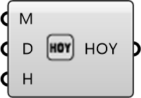

##  Date to HOY

Date to HOY
 
 Converts a specific Date and Time (Month, Day, Hour) into a single 'Hour of Year' integer (1-8760). Essential for querying specific timestamps in annual data.
 
 
 Eddy3D 0.5.0.815

#### Input
* ##### M 
Month [1-12]
* ##### D 
Day [1-31]
* ##### H 
Hour [0-23]

#### Output
* ##### HOY
Hour Of Year