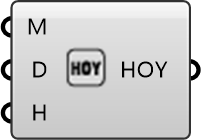

##  Date to HOY

Date to HOY

 Converts a specific Date and Time (Month, Day, Hour) into a single 'Hour of Year' integer (1-8760). Essential for querying specific timestamps in annual data.

 Eddy3D 1.0.0.827

#### Input
* ##### M 
Month [1-12]
* ##### D 
Day [1-31]
* ##### H 
Hour [0-23]

#### Output
* ##### HOY
Hour Of Year