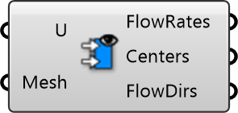

##  Flow Rates

Compute flow rates across a mesh while treating its vertices as velocity probes.
 Eddy3D 0.5.0.815

#### Input
* ##### U 
List of velocity vectors that correspond the the vertices of a mesh.
* ##### Mesh 
Mesh with vertices are to be evaluated.

#### Output
* ##### FlowRates
Volumetric flow rates of mesh faces in m^3/s.
* ##### Centers
Centers of the mesh faces
* ##### FlowDirs
FlowDirs 