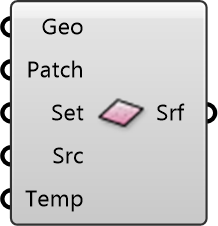

##  Ground Surface

Ground Material
 
 Defines properties for ground surfaces like asphalt, concrete, or soil. Critical for analyzing the Urban Heat Island effect.
 
 
 Eddy3D 0.5.0.815

#### Input
* ##### Geo 
Ground surface geometry (Breps). Will be meshed into analysis patches.
* ##### Patch 
Size of analysis mesh patches. Units: meters. Default: 3m
* ##### Set 
Optional: Material settings (albedo, emissivity) from Surface Settings component.
* ##### Src 
Surface temperature data source (EnergyPlus, measured, or user-defined).
* ##### Temp 
Optional: User-defined surface temperatures. Units: °C

#### Output
* ##### Srf
Ground surface for MRT Simulation component