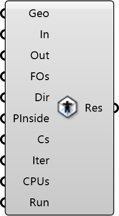

##  Indoor Simulation

Indoor Airflow Solver
 
 Simulates buoyancy-driven airflow, temperature distribution, and contaminant transport within an indoor space.
 
 Uses OpenFOAM's 'buoyantSimpleFoam' solver.
 Requires connected walls, inlets, outlets, and optional heat sources.
 
 
 Eddy3D 0.5.0.815

#### Input
* ##### Geo 
Indoor CFD Walls
* ##### In 
Indoor CFD Inlets
* ##### Out 
Indoor CFD Outlets
* ##### FOs 
Indoor CFD Function Objects
* ##### Dir 
Working Directory
* ##### PInside 
Point inside domain.
* ##### Cs 
Cell Size
* ##### Iter 
Iterations for Simulation.
* ##### CPUs 
Number of CPUs to decompose the simulation with.
* ##### Run 
Run case setup routines and simulation

#### Output
* ##### Res
Indoor simulation result for post-processing