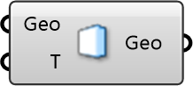

##  Indoor Wall

Indoor Wall/Boundary
 
 Defines a solid boundary for indoor simulations, such as walls, floors, or ceilings. Allows specification of surface temperature for thermal analysis.
 
 
 Eddy3D 0.5.0.815

#### Input
* ##### Geo 
Geometry
* ##### T 
Temperature [C]

#### Output
* ##### Geo
Geometry