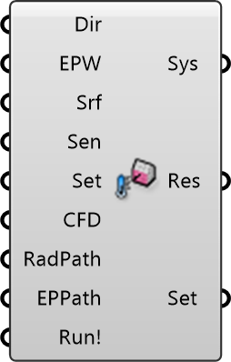

##  MRT Simulation

Mean Radiant Temperature (MRT) Solver
 
 Calculates MRT, a key metric for thermal comfort, using ray-tracing and view factors.
 Combines:
 - Direct Solar Radiation
 - Diffuse Sky Radiation
 - Longwave Surface Emissions
 
 
 Eddy3D 0.5.0.815

#### Input
* ##### Dir 
Folder for simulation files. Default: C:\Temp\Eddy3d
* ##### EPW 
Path to EnergyPlus weather file (.epw) for climate data.
* ##### Srf 
Radiation surfaces from Building/Ground/Tree Surface components.
* ##### Sen 
Analysis locations as Mesh or RProbe objects.
* ##### Set 
Optional: Simulation settings (Radiance parameters, timestep).
* ##### CFD 
Optional: Path to .wind.eddy file for wind-coupled MRT analysis.
* ##### RadPath 
Optional: Custom Radiance bin folder. Default: C:\Users\pkastner\AppData\Roaming\Eddy3D\Radiance_012cb178_Windows\bin
* ##### EPPath 
Optional: Custom EnergyPlus folder. Default: C:\EnergyPlusV9-4-0
* ##### Run! 
Set True to execute MRT simulation.

#### Output
* ##### Sys
MRT simulation system object
* ##### Res
Path to .mrt.eddy result file for post-processing
* ##### Set
Current simulation settings (for reference)