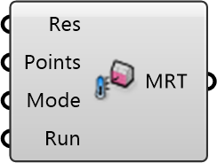

##  Mean Radiant Temperature

Mean Radiant Temperature.
 
 This is based on a TwoPhaseDDS approach for which it is assumed that the building surface temperature equals the ambient temperature.
 We run a sky view factor analysis, followd by the TwoPhaseDDS method taking into account direct solar gain.
 
 For large models or lots of probing points, it might take a moment until the commandline shows up.
 Please make sure Radiance is installed at: "C:\Program Files\Radiance".
 
 
 Eddy3D 0.5.0.815

#### Input
* ##### Res 
Simulation Result
* ##### Points 
List of probing points
* ##### Mode 
Pick a simulation mode
* ##### Run 
Run the calculation

#### Output
* ##### MRT
Mean Radiant Temperature [°C] Object