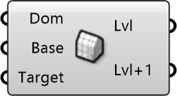

##  Mesh Cell Size

Calculate required mesh refinement levels for a target cell size.
 
 Based on the blockMesh base cell size, this calculates how many 
 refinement levels (halving) are needed to reach your target resolution.
 
 
 Eddy3D 0.5.0.815

#### Input
* ##### Dom 
CFD Simulation Domain (Cylindrical or Box).
* ##### Base 
Base mesh cell size from Domain component. Units: meters.
* ##### Target 
Desired final cell size at highest refinement level. Units: meters.

#### Output
* ##### Lvl
Refinement level (n) required to reach target cell size.
* ##### Lvl+1
One level higher than required (finer resolution).