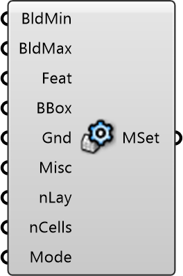

##  Mesh Settings

Meshing Parameters
 
 Controls the resolution and quality of the simulation grid (mesh). Adjust cell sizes to balance between simulation accuracy and computation time.
 
 
 Eddy3D 0.5.0.815

#### Input
* ##### BldMin 
Minimum refinement level for building surfaces. Higher = finer. Typical: 2-3. Default: 2
* ##### BldMax 
Maximum refinement level for building surfaces. Must be >= min. Default: 2
* ##### Feat 
Refinement level for building corners and features. Default: 2
* ##### BBox 
Refinement level for region around buildings. 0 = no extra refinement. Default: 0
* ##### Gnd 
Refinement level for ground surface. Default: 2
* ##### Misc 
0: Default, 1: Optimized quality settings
* ##### nLay 
Number of mesh layers near walls. More = better boundary layer resolution. Default: 4
* ##### nCells 
Number of cells between refinement levels. More = smoother transition. Default: 4
* ##### Mode 
0: No snapping (fast debug), 1: With snapping (production), 2: With layers (accurate but slow)

#### Output
* ##### MSet
Mesh settings object to connect to Simulation component