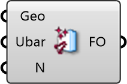

##  Momentum Source

Fan / Jet Source
 
 Creates a volume that actively pushes air in a specific direction. Use this to model fans, blowers, HVAC supply jets, or other active airflow devices.
 
 
 Eddy3D 0.5.0.815

#### Input
* ##### Geo 
Geometry
* ##### Ubar 
Ubar.
 
 Desired mean velocity.
* ##### N 
Name

#### Output
* ##### FO
Momentum Source Function Object