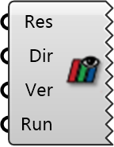

##  Open ParaView

Launch ParaView for 3D CFD result visualization.

 Opens simulation results in ParaView for visualizing velocity fields,
 pressure distributions, and streamlines. ParaView must be installed.

 Eddy3D 1.0.0.827

#### Input
* ##### Res 
Simulation result from Wind Simulation component.
* ##### Dir 
Wind directions to visualize (subset or all).
* ##### Ver 
Paraview version
* ##### Run 
Start Paraview

#### Output