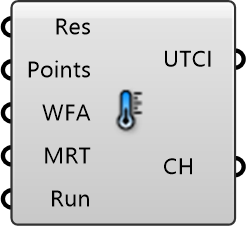

##  Outdoor Thermal Comfort

Outdoor Thermal Comfort. This components computes the UTCI from the outdoor comfort objects passed. For the wind velocities, a scale-up to 10 m height above ground is applied.
 Eddy3D 0.5.0.815

#### Input
* ##### Res 
Eddy simulation result
* ##### Points 
List of probing points
* ##### WFA 
Wind Factors Annual Object
* ##### MRT 
Mean Radiant Temperature [°C] Object
* ##### Run 
Run the calculation

#### Output
* ##### UTCI
Universal Thermal Climate Index [°C] Object
* ##### CH
Percentage of comfortable hours (9°C <= UTCI <= 26°C) over the year