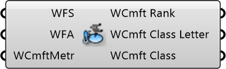

##  Pedestrian Wind Comfort

Pedestrian Wind Comfort Analysis
 
 Evaluates annual wind velocities to determine suitability for sitting, standing, or walking.
 Calculates maximum allowable exceedance probability based on wind statistics.
 Assumes probing height at 1.75m above ground.
 
 General Lawson
 
 1 - A   > 1.8 m/s <   2 %   Sitting Long
 2 - B   > 3.6 m/s <   2 %   Sitting Short
 3 - C   > 5.3 m/s <   2 %   Walking Leisurely
 4 - D   > 7.6 m/s >   5 %   Walking Fast
 5 - E   > 7.6 m/s >=  2 %   Uncomfortable
 
 Lawson LDDC
 
 1 - A   > 2.5 m/s < 5 %       Frequent sitting
 2 - B   > 4 m/s   < 5 %       Occasional sitting
 3 - C   > 6 m/s   < 5 %       Standing
 4 - D   > 8 m/s   < 5 %       Walking
 5 - E   > 8 m/s   > 5 %       Uncomfortable
 6 - S   > 15 m/s  > 0.022 %   Unsafe
 
 Lawson 2001
 
 1 - A   > 4 m/s     < 5 %       Sitting
 2 - B   > 6 m/s     < 5 %       Standing
 3 - C   > 8 m/s     < 5 %       Strolling
 4 - D   > 10 m/s    < 5 %       Business Walking
 5 - E   > 10 m/s    > 5 %       Uncomfortable
 6 - S15 > 15 m/s    > 0.023 %   Unsafe frail
 7 - S20 > 20 m/s    > 0.023 %   Unsafe all
 
 Davenport
 
 1 - A   > 3.6 m/s   <   1.5 %   Sitting Long
 2 - B   > 5.3 m/s   <   1.5 %   Sitting Short
 3 - C   > 7.6 m/s   <   1.5 %   Walking Leisurely
 4 - D   > 9.8 m/s   <   1.5 %   Walking Fast
 5 - E   > 9.8 m/s   >=  1.5 %   Uncomfortable
 6 - S   > 15.1 m/s  >=  0.01 %  Dangerous
 
 NEN8100 Comfort
 
 1 - A   > 5 m/s     < 2.5 %     Sitting Long
 2 - B   > 5 m/s     < 5 %       Sitting Short
 3 - C   > 5 m/s     < 10 %      Walking Leisurely
 4 - D   > 5 m/s     < 20 %      Walking Fast
 5 - E   > 5 m/s     > 20 %      Uncomfortable
 6 - S   > 15 m/s    > 0.05 %    Dangerous
 
 NEN8100 Safety
 
 1 - A   > 15 m/s    < 0.05 %    No Risk,
 2 - B   > 15 m/s    < 0.3 %     Limited Risk
 3 - C   > 15 m/s    > 0.3 %     Dangerous
 
 
 Eddy3D 0.5.0.815

#### Input
* ##### WFS 
Wind Factors Spatial Object
* ##### WFA 
Wind Factors Annual Object
* ##### WCmftMetr 
Select a Wind Comfort Metric with a right click.

#### Output
* ##### WCmft Rank
Wind Comfort Rank
* ##### WCmft Class Letter
Wind Comfort Class Letter
* ##### WCmft Class
Wind Comfort Class