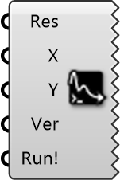

##  Plot Residuals

Convergence Monitor
 
 Visualizes the definition of simulation convergence (residuals) in real-time. Helps verify if the simulation has reached a stable solution.
 
 
 Eddy3D 0.5.0.815

#### Input
* ##### Res 
Simulation result from Wind Simulation component.
* ##### X 
Iteration axis range. Format: 'min:max'. Example: '0:5000'
* ##### Y 
Residual axis range (log scale). Format: 'min:max'. Example: '0.00001:1'
* ##### Ver 
0: BlueCFD Gnuplot, 1: Windows Gnuplot
* ##### Run! 
Set True to display residual plot.

#### Output