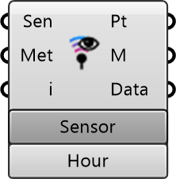

##  Point Probe Inspector

Point Probe Inspector
 
 Visualizes simulation data at specific sensor points. Displays metrics like Wind Speed, UTCI, or MRT for individual locations or hours.
 
 
 Eddy3D 0.5.0.815

#### Input
* ##### Sen 
Simulation Sensor
* ##### Met 
Metric
* ##### i 
Hour or sensor index

#### Output
* ##### Pt
Point
* ##### M
Mesh
* ##### Data
Data