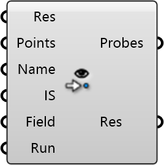

##  Probe Simulation

Point Probe Inspector
 
 Samples the wind field at specific locations. Use this to query wind speed and pressure at points of interest like building entrances or balconies.
 
 
 Eddy3D 0.5.0.815

#### Input
* ##### Res 
Eddy Result
* ##### Points 
List of probing points
* ##### Name 
Name of instance to be probed
* ##### IS 
Interpolation Scheme
* ##### Field 
Name of field to be probed
* ##### Run 
Run the component.

#### Output
* ##### Probes
List of probing points (caution: maybe culled)
* ##### Res
Probed results [DataTree] where the [branches] are the wind directions and the [items] are the values for each probing point.