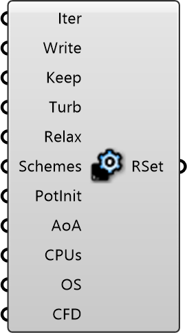

##  Run Settings

Solver Control
 
 Configures the simulation engine, including calculation iterations, convergence criteria, and parallel processing options (CPUs).
 
 
 Eddy3D 0.5.0.815

#### Input
* ##### Iter 
Maximum solver iterations. Higher = more accurate but slower. Typical: 500-2000. Default: 1000
* ##### Write 
Save results every N iterations. Lower = more disk space. Typical: 10-50. Default: 20
* ##### Keep 
Number of saved timesteps to retain on disk. Older saves are deleted. Default: 3
* ##### Turb 
RANS turbulence model. k-epsilon is fast and robust for urban flows. k-omega SST is more accurate near walls.
* ##### Relax 
Under-relaxation for solver stability. Robust is safer for complex geometry. Default: Optimized
* ##### Schemes 
Discretization schemes for equations. Optimized balances accuracy and stability.
* ##### PotInit 
Initialize with potentialFoam for faster convergence. Recommended for new simulations. Default: false
* ##### AoA 
Calculate mean age of air (ventilation effectiveness). Must be enabled before running simulation.
* ##### CPUs 
Parallel processing cores. -1 = auto-detect. More cores = faster but needs more RAM. Default: 1
* ##### OS 
Target OS for simulation scripts. Auto-detect works in most cases.
* ##### CFD 
Custom BlueCFD installation path. Default: C:\Program Files\blueCFD-Core-2020

#### Output
* ##### RSet
Solver configuration object to connect to Wind Simulation component