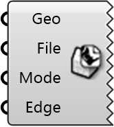

##  STL Exporter

Export geometry to STL format for OpenFOAM or other CFD tools.
 
 Supports meshes and Breps (auto-meshed). Select between binary or ASCII 
 output and single or multiple file export.
 
 
 Eddy3D 0.5.0.815

#### Input
* ##### Geo 
Meshes or Breps to export.
* ##### File 
Destination file path (.stl).
* ##### Mode 
Export mode: 0=Binary, 1=ASCII, 2=Binary (Multi-file), 3=ASCII (Multi-file)
* ##### Edge 
Optional: Maximum edge length for auto-meshing Breps. Units: meters.

#### Output