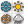

##  Season Filter

Filter analysis results by meteorological season.

 Winter: Dec-Feb, Spring: Mar-May, Summer: Jun-Aug, Fall: Sep-Nov.
 Use to calculate seasonal comfort or radiation metrics.

 Eddy3D 1.0.0.827

#### Input
* ##### Season 
Season to filter. 0=Winter, 1=Spring, 2=Summer, 3=Fall

#### Output
* ##### Filter
Time filter for Inspect components