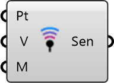

##  Sensor

Single Point Sensor

 Creates a single sensor point for detailed MRT analysis at a specific location, such as a specific seat or standing spot.

 Eddy3D 1.0.0.827

#### Input
* ##### Pt 
Sensor node
* ##### V 
Sensor normal
* ##### M 
Mesh geometry for previews

#### Output
* ##### Sen
Radiation Simulation Sensor