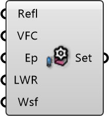

##  Settings

Radiation Settings
 
 Configures accuracy and detail for the MRT simulation, including solar ray-tracing quality and reflections.
 
 
 Eddy3D 0.5.0.815

#### Input
* ##### Refl 
ComputeReflectionsAndDiffuseRadiation
* ##### VFC 
CummulativeViewFactorCutoffPercentile
* ##### Ep 
ComputeSurfaceTemperatureEnergyPlus
* ##### LWR 
ComputeLongWaveExchangeEnergyPlus
* ##### Wsf 
Wind scaling factor

#### Output
* ##### Set
Simulation settings 