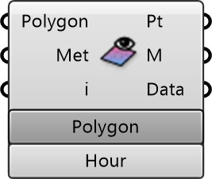

##  Surface Result Inspector

Surface Result Inspector
 
 Visualizes simulation results on surface polygons (e.g., building facades, ground). Displays metrics like Surface Temperature or Radiation exposure.
 
 
 Eddy3D 0.5.0.815

#### Input
* ##### Polygon 
Simulation Polygon
* ##### Met 
Metric
* ##### i 
Hour or sensor index

#### Output
* ##### Pt
Point
* ##### M
Mesh
* ##### Data
Data