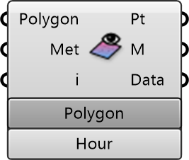

##  Surface Result Inspector

Surface Result Inspector

 Visualizes simulation results on surface polygons (e.g., building facades, ground). Displays metrics like Surface Temperature or Radiation exposure.

 Eddy3D 1.0.0.827

#### Input
* ##### Polygon 
Simulation Polygon
* ##### Met 
Metric
* ##### i 
Hour or sensor index

#### Output
* ##### Pt
Point
* ##### M
Mesh
* ##### Data
Data