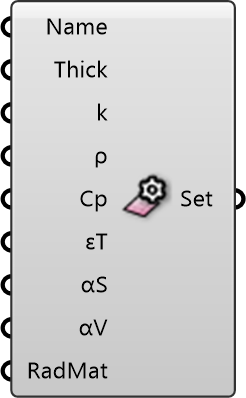

##  Surface Settings

Material Properties
 
 Defines thermal and optical properties for building or ground surfaces (e.g., concrete, asphalt). Controls heat calculation parameters like conductivity, density, and emissivity.
 
 
 Eddy3D 0.5.0.815

#### Input
* ##### Name 
Material identifier (for reference).
* ##### Thick 
Material thickness. Units: m. Default: 0.1
* ##### k 
Thermal conductivity. Units: W/(m·K). Concrete: 2.3. Default: 2.3
* ##### ρ 
Material density. Units: kg/m³. Concrete: 2400. Default: 2400
* ##### Cp 
Specific heat capacity. Units: J/(kg·K). Default: 840
* ##### εT 
Longwave emissivity (0-1). High for most materials. Default: 0.9
* ##### αS 
Solar absorptance (0-1). Light surfaces ~0.3, dark ~0.9. Default: 0.7
* ##### αV 
Visible absorptance (0-1). Default: 0.7
* ##### RadMat 
Optional: Custom Radiance material string

#### Output
* ##### Set
Surface settings for Building/Ground Surface component