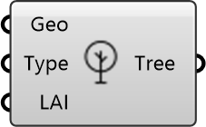

##  Tree

Tree Modeler
 
 Represents trees as porous media for wind blocking. Essential for simulating the wind-sheltering effects of vegetation.
 
 
 Eddy3D 0.5.0.815

#### Input
* ##### Geo 
Tree/vegetation geometry (one per tree for correct sizing).
* ##### Type 
Tree density type: 'coarse', 'medium', or 'dense'. Or custom Darcy-Forchheimer A,B coefficients.
* ##### LAI 
Leaf Area Index. Typical: 2 (sparse) to 6 (dense). Alternative to Type.

#### Output
* ##### Tree
Tree object for Domain component