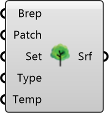

##  Tree Surface

Tree Canopies
 
 Converts tree geometries for radiation analysis. Simulates shading and evapotranspiration cooling effects.
 
 
 Eddy3D 0.5.0.815

#### Input
* ##### Brep 
Tree canopy geometry as Brep(s).
* ##### Patch 
Mesh subdivision size. Units: m. Default: 3
* ##### Set 
Optional: Material settings from Tree Settings component.
* ##### Type 
Surface temperature calculation method.
* ##### Temp 
Override surface temperature. Units: °C

#### Output
* ##### Srf
Tree surfaces for MRT Simulation component